# Chain Reaction Cycles – Sales Performance Analysis
**Author:** Chau My Phuong

**Date:** June 2024

**Project Description**

In today’s business landscape, data has become one of the most valuable assets any organization can possess. This project leverages the real-world-like AdventureWorks Sales dataset to deeply analyze the sales performance of Chain Reaction Cycles – once the world’s largest online bicycle retailer. The result is a production-grade analytics dashboard that reveals exactly where profit is made and lost across channels, regions, product lines, seasons, and resellers – turning raw numbers into clear business decisions.

The project covers the lifecycle including: data collection, cleansing, advanced DAX measurements, modeling, visualizations, exploratory analysis, and actionable strategic recommendations.

**Project Objectives**
- Evaluate the current sales performance of Chain Reaction Cycles Company
- Propose solutions to improve sales performance
- Propose marketing strategies to attract more potential customers
- Propose measures to increase conversion rates
- Propose pricing strategies to maximize profits
- Propose measures to improve customer experience
-----

# Background
## Overall
- **Company Name:** Chain Reaction Cycles (CRC)
- **Year Established:** 1985
- **Business Industry:** Bicycles, including bicycles, parts and accessories.
- **Business Size:** Small Retail
- **Market segment:** cycling enthusiasts, from beginners to professional riders.
- **Products:** mountain bikes, road bikes, city bikes, and accessories and spare parts.
- **Awards and achievements:** CRC's customer support team won the "Customer Service Team of the Year" award for the whole of Europe for their efficient workflow and ability to use customer feedback to improve service
- **Vision:** Chain Reaction Cycles aims to be the world's leading bicycle retailer, providing the best online cycling shopping experience for customers worldwide.
- **Mission:** Chain Reaction Cycles is committed to providing high-quality products and services, dedicated customer support, and always updating technology to improve the user experience.

## History:
 - Chain Reaction Cycles began as a small shop called Ballynure Cycles in Northern Ireland in 1985, founded by George and Janice Watson.
 - In 1998, the business moved to mail order
 - In 1999 launched ChainReactionCycles.com, serving customers in over 155 countries, ushering in a period of strong growth in e-commerce.
 - CRC rapidly expanded to become one of the world's leading online bicycle retailers, with sales peaking in 2013.
 - In 2016, Chain Reaction Cycles merged with Wiggle to form the WiggleCRC group.
 - The group then achieved an annual turnover of over £300 million and expanded further with the acquisition of German company Bike24 in 2017.

## Organizational chart
Chain Reaction Cycles operates under the management of an executive board consisting of senior managers from various departments. Departments include:
- **Sales and marketing department:** Responsible for promoting and selling products.
- **Customer service department:** Multilingual customer support team, answering questions and handling warranty-related issues.
- **Warehouse and shipping department:** Manages the storage and shipping of goods to customers worldwide.
- **Engineering department:** Ensures bicycle products and components are assembled and quality tested before shipping.

## Daily Operations
CRC's daily operations include warehouse management, online order processing, customer service, website management, and online marketing campaigns. CRC also invests in improving customer service and optimizing delivery times worldwide.
- **Order Processing:** Each week, Chain Reaction Cycles processes approximately 100,000 products and ships them to customers worldwide. CRC's state-of-the-art warehouse management system and staff ensure that orders are processed quickly and accurately, efficiently meeting the shopping needs of global customers.
- **Multilingual Customer Support:** CRC's customer support team of 82 people is fluent in 7 languages: English, French, Italian, Spanish, German, Russian, and Portuguese. The customer service team is available from 7am to 6pm, 7 days a week to support customers via phone, email, social media and online chat.
- **Inventory management and shipping process:** CRC's large inventory management system is optimized to track and maintain accurate inventory levels to ensure that products are always available to customers. CRC's shipping process is also designed to optimize delivery times and shipping costs for customers.

## Purpose and significance of data collection and data analysis
Data collection and analysis helps CRC better understand customer shopping behavior, market trends and consumer needs. This allows CRC to optimize marketing strategies, improve customer experience and manage inventory more effectively. Specifically:
- **Customer shopping behavior:** Helps identify customer trends and preferences, develop more accurate and effective marketing strategies.
- **Market trends:** Helps predict customer demand and adjust inventory levels appropriately, avoiding shortages or surpluses.
- **Customer experience:** Helps identify areas for improvement in the shopping process and customer service, improve service quality and increase customer satisfaction customer flow.
In addition, data analysis also helps CRC optimize internal processes such as inventory management, order processing and shipping. Monitoring and analyzing data helps detect problems and bottlenecks in the process, propose timely improvement measures, improve operational efficiency, minimize costs and enhance competitiveness in the market.

# Data introduction
The data used for this project is extracted from a single data file, providing a comprehensive view of sales activities.
- **Data file name:** 4-AdventureWorks Sales.xlsx
- **Source:** Data provided by lecturer Pham Thi Thanh Tam.

This data file includes 7 separate sheets/tables, linked together to describe the business process and related entities in detail. The combination of these tables allows the team to perform multidimensional analysis of business activities, thereby making effective assessments and strategic recommendations.

**16 data tables include:**
1. **SalesOrderLine:** Contains line items for sales orders, identifying each product in an order.
2. **SalesOrder:** Contains detailed information about orders that have been placed.
3. **Sales:** The main transaction data table, records sales events.
4. **Channel:** Dimension table for sales channels.
5. **Sales Territory:** Contains information about the geographical areas where sales activities take place.
6. **Country:** Countries involved in sales (United States, Canada, France, Germany, Australia, United Kingdom), grouped by regions.
7. **Group:** High-level geographic groups (North America, Europe, Pacific)
8. **City:** Cities with associated state/provinces.
9. **State-Province:** States or provinces linked to countries.
10. **Reseller:** Contains information about retail partners.
11. **Business Type:** Types of reseller businesses (Value Added Reseller, Specialty Bike Shop, Warehouse)
12. **Date:** Contains time-related data (often used for cyclical analysis).
13. **Product:** Contains descriptive information about the items sold.
14. **Subcategory:** Product subcategories
15. **Category:** High-level product categories
16. **Customer:** Contains detailed information about customers who purchased the product.

**Specific table data description:**

**1. SalesOrderLine** 
| No. | Attribute Name | Description | Data Type | Note |
|:---:|:---|:---|:---:|:---|
| 1 | SalesOrderLineKey | Unique identifier for each order line | Number | Primary Key |
| 2 | Sales Order Line | Human-readable sales order + line number | Short Text | Display purpose |

**2. SalesOrder** 
| No. | Attribute Name | Description | Data Type | Note |
|:---:|:---|:---|:---:|:---|
| 1 | Sales Order | Sales order number | Short Text |
| 2 | SalesOrderLineKey | Link to individual line item | Number | Foreign Key |
| 3 | Sales Order Line | Line identifier within the order | Short Text |
| 4 | ChannelKey | Sales channel (1 = Reseller, 2 = Internet) | Number | Foreign Key |

**3. Sales** (Fact Table) 
| No. | Attribute Name | Description | Data Type | Note |
|:---:|:---|:---|:---:|:---|
| 1 | SalesOrderLineKey | Link to order line | Number | Primary / Foreign Key |
| 2 | ResellerKey | Reseller ID | Number | Foreign Key |
| 3 | CustomerKey | Customer ID | Number | Foreign Key |
| 4 | ProductKey | Product sold | Number | Foreign Key |
| 5 | OrderDateKey | Date of order | Number | Foreign Key to Date |
| 6 | DueDateKey | Promised delivery date | Number | Foreign Key to Date |
| 7 | ShipDateKey | Actual shipping date | Number | Foreign Key to Date |
| 8 | SalesTerritoryKey | Sales territory/region | Number | Foreign Key |
| 9 | Order Quantity | Quantity ordered | Number |
| 10 | Unit Price | Selling price per unit (after discount) | Currency |
| 11 | Sale Amount | Line total (Quantity × Unit Price) | Currency |
| 12 | Product Standard Cost | Standard manufacturing cost per unit | Currency |
| 13 | Total Product Cost | Total cost (Quantity × Standard Cost) | Currency |

**4. Channel** 
| No. | Attribute Name | Description | Data Type | Note |
|:---:|:---|:---|:---:|:---|
| 1 | ChannelKey | Unique key | Number | Primary Key |
| 2 | Channel | Channel name (Reseller / Internet) | Short Text |

**5. SalesTerritory** 
| No. | Attribute Name | Description | Data Type | Note |
|:---:|:---|:---|:---:|:---|
| 1 | SalesTerritoryKey | Unique territory key | Number | Primary Key |
| 2 | Region | Region name ( Northwest) | Short Text |
| 3 | CountryKey | Link to Country table | Number | Foreign Key |

**6. Country** 
| No. | Attribute Name | Description | Data Type | Note |
|:---:|:---|:---|:---:|:---|
| 1 | CountryKey | Unique key | Number | Primary Key |
| 2 | Country | Country name | Short Text |
| 3 | GroupKey | Link to geographic group | Number | Foreign Key |

**7. Group** 
| No. | Attribute Name | Description | Data Type | Note |
|:---:|:---|:---|:---:|:---|
| 1 | GroupKey | Unique key | Number | Primary Key |
| 2 | Group | Region group | Short Text |

**8. City** 
| No. | Attribute Name | Description | Data Type | Note |
|:---:|:---|:---|:---:|:---|
| 1 | CityKey | Unique key | Number | Primary Key |
| 2 | City | City name | Short Text |
| 3 | StateProvinceKey | Link to State-Province table | Number | Foreign Key |

**9. State-Province** 
| No. | Attribute Name | Description | Data Type | Note |
|:---:|:---|:---|:---:|:---|
| 1 | StateProvinceKey| Unique key | Number | Primary Key |
| 2 | State-Province | State or province name | Short Text |
| 3 | CountryID | Link to Country | Number | Foreign Key |

**10. Reseller** 
| No. | Attribute Name | Description | Data Type | Note |
|:---:|:---|:---|:---:|:---|
| 1 | ResellerKey | Unique key | Number | Primary Key |
| 2 | Reseller ID | Business code | Short Text |
| 3 | TypeID | Link to Business Type | Number | Foreign Key |
| 4 | ResellerName | Reseller company name | Short Text |
| 5 | CityKey | Location of reseller | Number | Foreign Key |

**11. Business Type** 
| No. | Attribute Name | Description | Data Type | Note |
|:---:|:---|:---|:---:|:---|
| 1 | TypeID | Unique key | Number | Primary Key |
| 2 | Business Type | Type of business | Short Text |

**12. Date** 
| No. | Attribute Name | Description | Data Type | Note |
|:---:|:---|:---|:---:|:---|
| 1 | DateKey | YYYYMMDD format | Number | Primary Key |
| 2 | Full Date | Readable date | Short Text |
| 3 | Year | Calendar year | Number |
| 4 | Month | Month number | Number |

**13. Product** 
| No. | Attribute Name | Description | Data Type | Note |
|:---:|:---|:---|:---:|:---|
| 1 | ProductKey | Unique product identifier | Number | Primary Key |
| 2 | SKU | Stock-keeping unit | Short Text |
| 3 | Product | Product name | Short Text |
| 4 | Standard Cost | Manufacturing standard cost | Currency |
| 5 | Color | Product color | Short Text |
| 6 | List Price | Original list price | Currency |
| 7 | Model | Model name | Short Text |
| 8 | SubcategoryKey | Link to Subcategory | Number | Foreign Key |

**14. Subcategory** 
| No. | Attribute Name | Description | Data Type | Note |
|:---:|:---|:---|:---:|:---|
| 1 | SubcategoryKey | Unique key | Number | Primary Key |
| 2 | Subcategory | Subcategory name | Short Text |
| 3 | Categorykey | Link to Category | Number | Foreign Key |

**15. Category** 
| No. | Attribute Name | Description Description | Data Type | Note |
|:---:|:---|:---|:---:|:---|
| 1 | CategoryKey | Unique key | Number | Primary Key |
| 2 | Category | Main category | Short Text |

**16. Customer** 
| No. | Attribute Name | Description | Data Type | Note |
|:---:|:---|:---|:---:|:---|
| 1 | CustomerKey | Unique key | Number | Primary Key |
| 2 | Customer ID | Business identification code | Short Text |
| 3 | Customer | Full name of the customer | Short Text |
| 4 | City | Customer city | Short Text |
| 5 | State-Province | State or province | Short Text |
| 6 | Country-Region | Country name | Short Text |
| 7 | Postal Code | Postal/ZIP code | Short Text |

# Data preparation & Pre-processing 
All preprocessing steps were performed in Power Query and Power Pivot (Excel/Power BI), resulting in a clean, well-structured, and analysis-ready data model.
## Data collection
After reviewing several datasets on Kaggle, I selected the AdventureWorks Sales dataset as the most suitable proxy for analyzing Chain Reaction Cycles (CRC) sales performance.

**Steps performed:**
- **Step 1:** Searched for relevant sales datasets on Kaggle
- **Step 2:** Downloaded the complete dataset
- **Step 3:** Extracted and chose the main file for analysis
 
→ **File used:** 4-AdventureWorks Sales.xlsx

## Data cleaning
The following cleaning actions were applied:
- **In the Date table:** 

Fiscal Year and Month columns were not in the desired format → reformatted using Excel formulas for consistency.
- **In the Sales fact table:**

 - Unit Price Discount Pct column contained only zeros across all rows → removed as redundant.
 - Because the Unit Price Discount Pct column is deleted data, it affects the Sales Amount column, so the Sales Amount column is also deleted.
 - Extended Amount was renamed to Sales Amount to correctly reflect line total revenue.

## Data transformation
To enable deeper and more flexible analysis, I transformed the flat structure into a proper Snowflake schema by normalizing dimension tables:
- Extracted Group and Country from SalesTerritory → created hierarchy: Group → Country → Territory
- Extracted Business Type from Reseller → created hierarchy: Business Type → Reseller
- Extracted Category and Subcategory from Product → created hierarchy: Category → Subcategory → Product
- Extracted Channel from Sales Order data → created hierarchy: Channel → SalesOrder

**Custom DAX Measures created:**
- **Profit:** Total Sales Amount - Total Cost
- **Profit Margin (%):** Profit divided by Total Sales Amount (formatted as a percentage)
- **Total Customers:** Count of the distinct values in the 'CustomerKey' column
- **Total Sale Orders:** Count of the distinct values in the 'Sales Order' column
- **Profit/Loss Flag:** "Profit" if Total Sale Amount - Total Product Cost is greater than zero, "Loss" if less than zero, and "Break Even" if equal to zero.
- **Total Loss Orders:** Count of distinct Sales Orders where the total Profit for that entire order is less than zero.
- **Total Profit Orders:** Count of distinct Sales Orders where the total Profit for that entire order is greater than zero.

## Data Reduction
In the Date table, the Monthkey and Date columns are the columns whose data will be deleted because this is redundant data for the group. In addition, the Customer table data is also chosen by the group to be ignored, not analyzed and used much other than to calculate the total number of customers who have purchased because the table data is difficult to analyze and does not have a clear connection with other tables as well as the Sales table.

## Data Model

- Model type: This is a Snowflake Schema data model
- Structure:
 - There is a central table called "Sales" (fact table).
 - Relationship between tables:
 - Sales → Date
 - Sales → SalesOrder → Channel 
 - Sales → Product → Subcategory → Category
 - Sales → SalesTerritory → Country → Group
 - Sales → Reseller → Business Type

# Analysis
## Overview dashboard

The Overview dashboard provides an overview of CRC's sales performance.

Financial metrics that businesses are interested in can help businesses monitor and evaluate sales performance.
- Standard cost: 43.97 million
- Total cost: 97.26 million
- Number of products sold: 275 thousand
- Total orders: 31 thousand
- Total revenue: 110.34 million
- Profit: 13.08 million
- Total customers: 18.49 thousand
- Profit margin: 11.85%

## 1. Analysis of Sales (Mixed view)
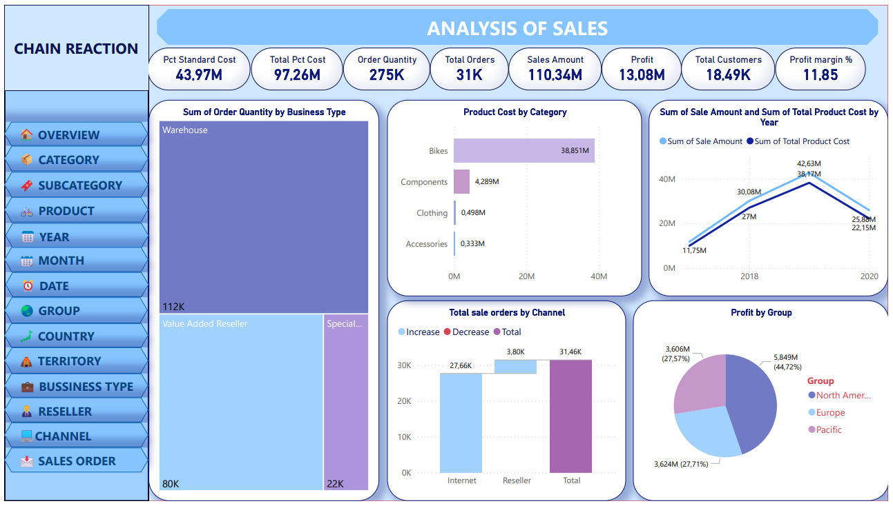
**Visual breakdown**

This is a hybrid or overview dashboard with elements
- **Sum of Order Quantity by Business Type (Vertical Bar Chart):** Warehouse 112K, Value Added Reseller (partial view, ~22K?).
- **Product Cost by Category (Bar Chart):** Bikes 38.851M, Components 4.298M, Clothing 0.498M, Accessories 0.333M.
- **Sum of Sale Amount and Sum of Total Product Cost by Year (Line Chart):** Sales rise from ~11.75M in 2018 to 42.63M in 2019, then dip to 38.37M in 2020; costs follow similar trend.
- **Total Sale Orders by Channel (Bar Chart with Increase/Decrease):** Internet 27.66K increase, Reseller 3.80K, Total 31.46K.
- **Profit by Group (Pie Chart):** North America 3.606M (27.57%), Europe 3.624M (27.71%), Pacific 5.849M (44.72%).

**Key Findings:**
- Order quantity by business type: Warehouse (112K), emphasizing its volume lead.
- Product costs by category: Bikes (38.851M), far outpacing others, aligning with high sales.
- Sales/costs by year: Peak in 2019 (42.63M sales), dip in 2020 (38.37M), with costs following closely.
- Orders by channel: Internet shows 27.66K increase, Reseller 3.80K, total 31.46K.
- Profit by group: Pacific (5.849M, 44.72%), Europe (3.624M, 27.71%), North America (3.606M, 27.57%), showing geographic diversity.

**Conclusion:** 2019 was a peak year, with Internet channel and Pacific group as growth areas; monitor 2020 dip for recovery strategies.

## 2. Analysis of Sales by Business type
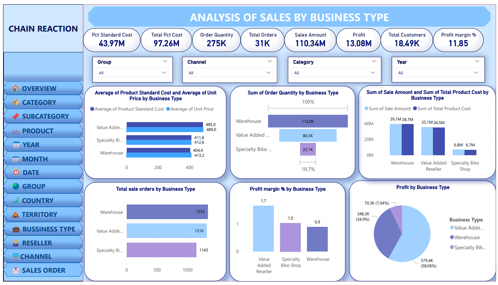
**Visual breakdown**

This dashboard breaks down performance by business types: Warehouse, Value Added Reseller, and Specialty Bike Shop.
- **Average Product Standard Cost and Average Unit Price (Bar Chart):** Warehouse has the lowest average unit price (413.2) and standard cost. Value Added Reseller has the highest (489.0 for price, 480.0 for cost). Specialty Bike Shop is in between (412.6 price, 411.8 cost).
- **Sum of Order Quantity (Bar Chart with %):** Warehouse leads with 112.0K (19.7%), followed by Value Added Reseller at 80.3K (14.1%), and Specialty Bike Shop at 22.1K (3.9%).
- **Sum of Sale Amount and Sum of Total Product Cost (Bar Chart):** Warehouse has the highest sales (39.13M) and cost (35.13M), Value Added Reseller (35.13M sales, 31.34M cost), Specialty Bike Shop (6.88M sales, 6.67M cost).
- **Total Sale Orders (Bar Chart):** Warehouse (1,335 orders), Value Added Reseller (1,316), Specialty Bike Shop (1,145).
- **Profit Margin % (Bar Chart):** Warehouse (1.7%), Value Added Reseller (1.0%), Specialty Bike Shop (0.9%).
- **Profit (Pie Chart):** Warehouse dominates with 70.3K (70.4%), Value Added Reseller 348.3K (34.9%), Specialty Bike Shop 579.4K (58.0%). (Note: Percentages appear inconsistent, possibly due to scaling or filtering.)

**Key Findings:**
- Warehouse leads in order quantity (112.0K, 19.7%) and sales amount (39.13M), but has the lowest average unit price (413.2).
- Value Added Reseller has the highest average unit price (489.0) and standard cost (480.0), with balanced sales (35.13M) and quantity (80.3K, 14.1%).
- Specialty Bike Shop trails in all metrics, with only 22.1K quantity (3.9%) and 6.88M sales, but similar costs/prices to Warehouse.
- Profit margins are low across the board: Warehouse (1.7%), Value Added Reseller (1.0%), Specialty Bike Shop (0.9%).
- Profit distribution shows Warehouse dominating (70.3K, 70.4%), despite low margins, indicating volume-driven profits.

**Conclusion:** Warehouse business type is the core driver of volume and profit, suggesting a focus on scaling this segment while improving margins in reseller types through pricing strategies.

## 3. Analysis of Sales by Reseller
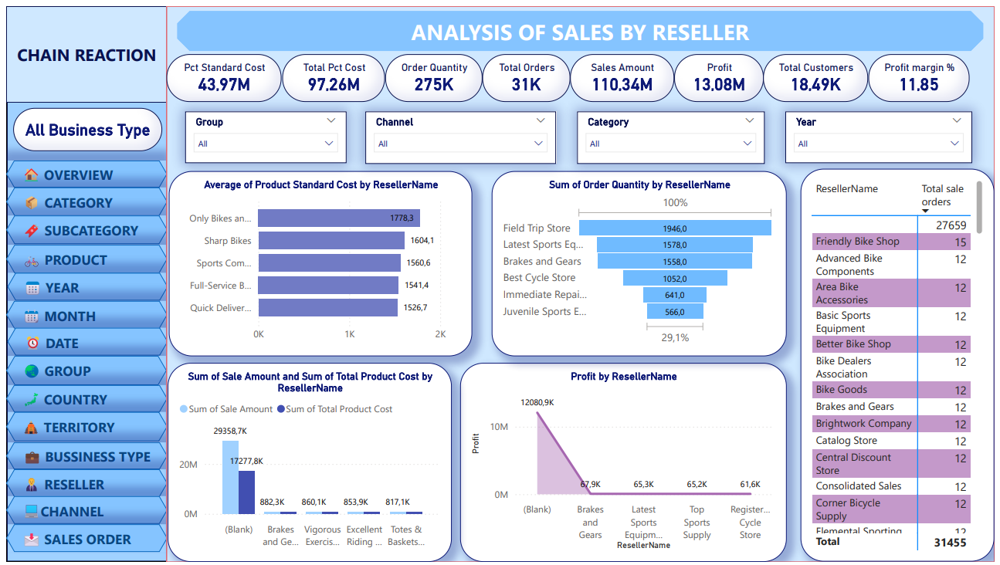
**Visual breakdown**

This dashboard shows reseller-specific performance.

- **Average Product Standard Cost (Bar Chart):** Only Bikes and More (1,778.3), Sharp Bikes (1,604.1), down to Quick Delivery Inc (1,526.7).
- **Sum of Order Quantity (Bar Chart with %):** Field Trip Store (19.4K, high %), Latest Sports Equipment (15.7K).
- **Total Sale Orders (Table):** Friendly Bike Shop (15), Advanced Bike Components (12), total 31,455.
- **Sum of Sale Amount and Total Product Cost by Reseller (Bar Chart):** High values like 299.58K for some.
- **Profit (Line Chart):** Declines from 1,280.9K to lower values like 61.6K.

**Key Findings:**

- Costs high for Only Bikes (1,778.3), quantities led by Field Trip Store (19.4K).
- Total orders: 31,455, with small per reseller (12-15).
- Profits decline from 1,280.9K, some as low as 61.6K.

**Conclusion:** Top resellers like Field Trip drive volume; nurture relationships while consolidating underperformers.

## 4. Analysis of Sales by Category
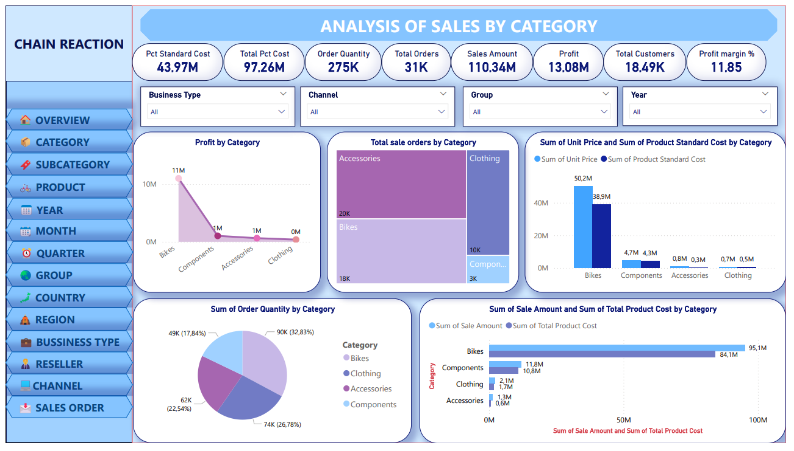
**Visual breakdown**

This dashboard focused on product categories: Bikes, Components, Accessories, Clothing.

- **Profit (Line Chart):** Declines from Bikes (11M) to Components (1M), Accessories (1M), and Clothing (0M).
- **Total Sale Orders (Stacked Bar Chart):** Accessories (40K), Bikes (20K), Clothing (10K), Components (18K).
- **Sum of Unit Price and Sum of Product Standard Cost (Bar Chart):** Bikes highest (50.2M price, 38.9M cost), followed by Components (4.7M price, 4.3M cost), Accessories (0.8M price, 0.3M cost), Clothing (4.3M price, 0.4M cost).
- **Sum of Order Quantity (Pie Chart):** Components 74K (26.9%), Clothing 90K (32.8%), Bikes 49K (17.8%), Accessories 62K (22.5%).
- **Sum of Sale Amount and Sum of Total Product Cost (Bar Chart):** Bikes lead (84.1M sales, 95.1M cost—wait, cost higher than sales indicates potential loss), Components (10.8M sales, 8.4M cost), Clothing (1.7M sales, 1.3M cost), Accessories (0.6M sales, 0.4M cost).

**Key Findings:**
- Bikes category dominates profit (11M), sales (84.1M), and costs (95.1M), but costs exceed sales, hinting at potential losses.
- Components follow with 10.8M sales and 1M profit, while Accessories and Clothing are minimal (0.6M and 1.7M sales, near-zero profit).
- Order quantity pie shows Components (74K, 26.9%) and Clothing (90K, 32.8%) leading in volume, but low value per unit.
- Unit prices are highest for Bikes (50.2M total), dropping sharply for others.
- Total orders stacked: Accessories (40K), Bikes (20K), indicating Accessories drive order frequency but not revenue.

**Conclusion:** Bikes are the revenue powerhouse but require cost optimization to avoid losses; diversifying into higher-margin Components could balance the portfolio.

## 5. Analysis of Sales by Subcategory
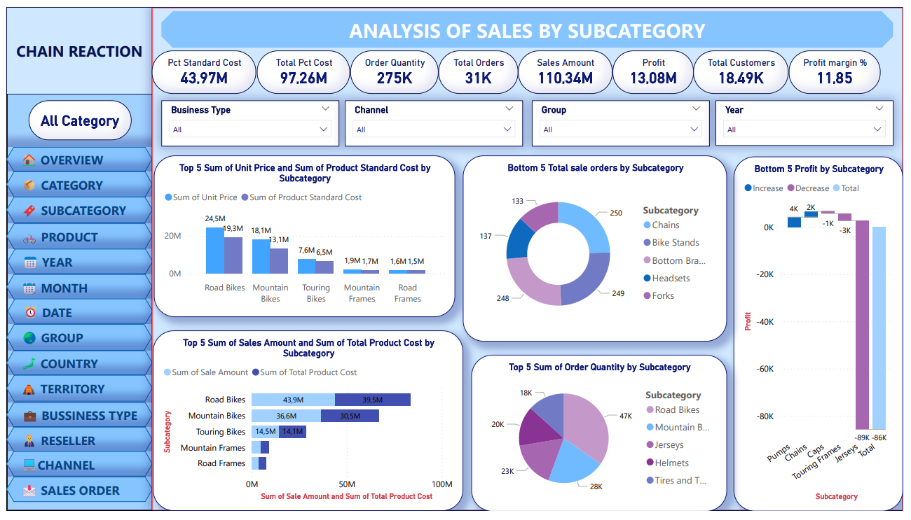
**Visual breakdown**

There are many subcategories like Road Bikes, Mountain Bikes, etc:

- **Top 5 Sum Unit Price and Product Standard Cost (Bar Chart):** Road Bikes (24.5M price, 19.3M cost), Mountain Bikes (18.1M, 13.1M).
- **Bottom 5 Total Sale Orders (Pie Chart):** Chains (133), Bike Stands (137), Bottom Brackets (248), Headsets (249), Forks (250).
- **Bottom 5 Profit (Bar Chart):** Negative or low, Chains (-89K total).
- **Top 5 Sum of Sale Amount and Total Product Cost (Bar Chart):** Road Bikes (43.9M sales, 39.5M cost), Mountain Bikes (36.6M, 30.5M).
- **Top 5 Sum of Order Quantity (Pie Chart):** Road Bikes (47K), Mountain Bikes (23K), Jerseys (28K), Helmets (28K), Tires and Tubes (18K).

**Key Findings:**
- Top sales: Road Bikes (43.9M), Mountain Bikes (36.6M).
- Bottom profits: Negative for Chains (-89K).
- Quantities: Road Bikes (47K), Helmets (28K).

**Conclusion:** Bike subcategories excel; address losses in accessories like Chains through discontinuation or repricing.

## 6. Analysis of Sales by Product
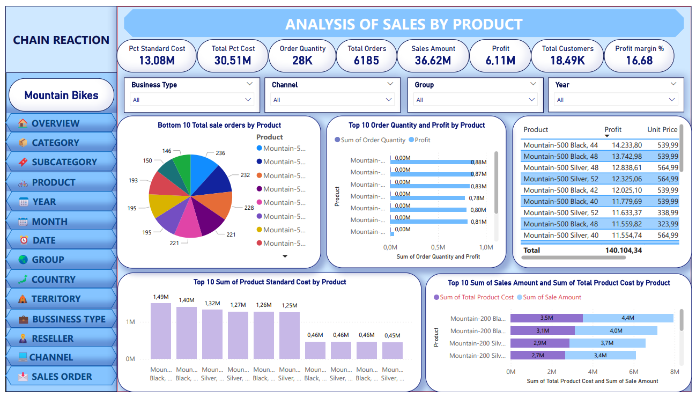
**Visual breakdown**

This dashboard filtered to Mountain Bikes subcategory:

- **Bottom 10 Total Sale Orders (Pie Chart):** Mountain-500 series dominate, Mountain-500 Silver (236 orders).
- **Top 10 Order Quantity and Profit (Bar Chart):** Mountain-200 Black (0.9M quantity, 0.88M profit—scales seem off, likely K).
- **Product, Profit, Unit Price (Table):** Mountain-500 Black 44 (14,233.80 profit, 539.99 price), similar for colors/variants.
- **Top 10 Sum Product Standard Cost (Bar Chart):** Mountain-200 Black (1.49M), similar variants ~1.2M-1.4M.
- **Top 10 Sum of Sales Amount and Total Product Cost (Bar Chart):** Mountain-200 Black (4.4M sales, 3.5M cost).

**Key Findings:**
- Bottom orders: Mountain-500 series (236+).
- Top profits: Mountain-200 Black (0.9M quantity, high profit).
- Prices: 539.99 for variants.
- Sales: Mountain-200 Black (4.4M, 3.5M cost).

**Conclusion:** Mountain Bikes subcategory is profitable; focus on top variants for inventory prioritization.

## 7. Analysis of Sales by Year

**Visual breakdown**

Yearly trends from 2017-2020:

- **Sum of Sale Amount (Bar Chart):** 2020 (43M), 2019 (30M), 2018 (12M), 2017 (4M).
- **Profit (Bar Chart):** 2019 (4.5M), 2020 (3.7M), 2018 (3.1M), 2017 (1.8M).
- **Profit Margin % (Bar Chart):** 2017 (15.42%), 2018 (10.21%), 2019 (10.47%), 2020 (9.96%).
- **Total Sale Orders (Stacked Bar Chart**): 2019 (14K), 2020 (4K), 2018 (13K), 2017 (2K).
- **Sum of Order Quantity (Line Chart):** Rises from 12K in 2017 to 127K in 2019, then 77K in 2020.
- **Sum of Total Product Cost (Pie Chart):** 2019 (38.2M, 39.24%), 2018 (22.1M, 22.77%), 2020 (9.9M, 10.22%), 2017 (27.0M, 27.77%).
- **Sum of Product Standard Cost (Pie Chart):** Similar distribution.

**Key Findings:**
- Sales growth: 4M (2017) to 43M (2020), with order quantity peaking at 127K (2019).
- Profit highest in 2019 (4.5M), margins declining from 15.42% (2017) to 9.96% (2020).
- Orders: 2019 (14K), showing volume surge.
- Product costs pie: 2019 (38.2M, 39.24%), 2018 (22.1M, 22.77%).
- Standard costs similar distribution, indicating consistent cost structure.

**Conclusion:** Strong growth trajectory until 2019, but declining margins in 2020 signal need for efficiency improvements to sustain profitability.

## 8. Analysis of Sales by Quarter
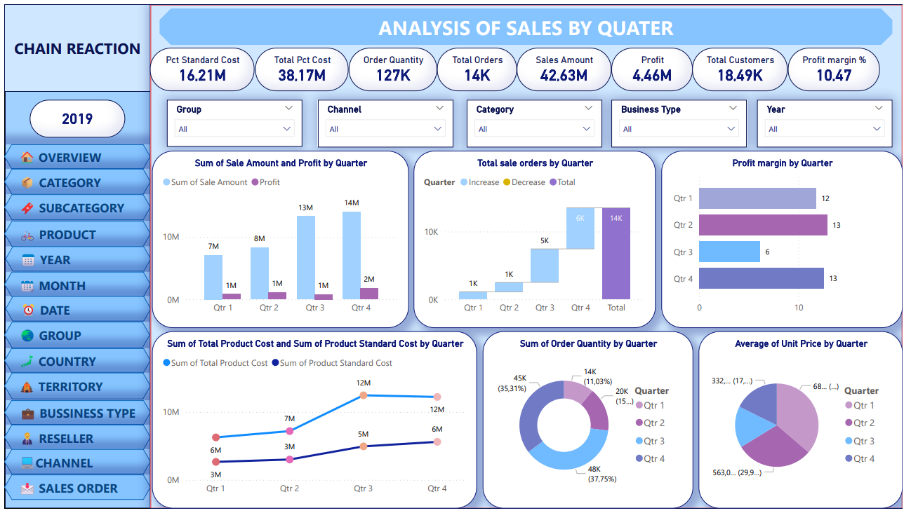
**Visual breakdown**

It filtered to 2019:

- **Sum of Sale Amount and Profit (Bar Chart):** Q4 14M sales (2M profit), Q3 13M (1M), Q2 8M (1M), Q1 7M (1M).
- **Total Sale Orders (Bar Chart with** Increase/Decrease): Q4 6K, Q3 5K, Q2 1K decrease, Q1 1K increase, Total 14K.
- **Profit Margin (Bar Chart):** Q1 12, Q2 13, Q3 6, Q4 13.
- **Sum of Total Product Cost and Product Standard Cost (Line Chart):** Costs rise to 12M in Q4.
- **Sum of Order Quantity (Pie Chart):** Q1 14K (35.31%), Q4 48K (37.75%), Q3 20K (10.93%), Q2 45K (35.31%).
- **Average Unit Price (Pie Chart):** Q1 332 (17%), Q2 68 (>25%)

**Key Findings:**
- Q4 strongest (14M sales, 2M profit, 13% margin).
- Quantities: Q1 (14K, 35.31%), Q4 (48K, 37.75%).
- Costs rise to 12M in Q4.

**Conclusion:** End-of-year surge indicates seasonal trends; plan inventory for Q4 peaks.

## 9. Analysis of Sales by Month
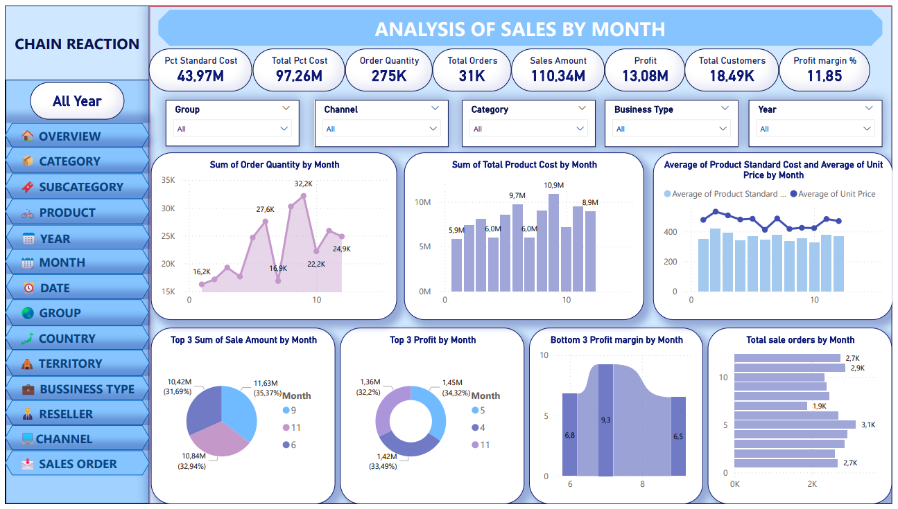
**Visual breakdown**

- **Sum of Order Quantity (Line Chart):** Peaks at 32.2K in month 3, dips to 16.8K in month 2, averages ~22K.
- **Sum of Total Product Cost (Bar Chart):** Highest in month 6 (10.9M), lowest in month 1 (5.9M).
**Average Product Standard Cost and Average Unit Price (Line Chart):** Unit price fluctuates around 300-400, standard cost stable ~200.
- **Top 3 Sum of Sale Amount (Pie Chart):** Month 9 (11.63M, 35.37%), Month 6 (10.84M, 32.94%), Month 11 (10.42M, 31.69%).
- **Top 3 Profit (Pie Chart):** Month 5 (1.45M, 34.33%), Month 4 (1.42M, 33.49%), Month 11 (1.36M, 32.2%).
- **Bottom 3 Profit Margin (Bar Chart):** Declines from 9.3 in month 6 to 6.5 in month 8.
- **Total Sale Orders (Bar Chart):** Highest ~3.1K in month 1, lowest 1.9K in month 8.

**Key Findings:**
- Order quantity peaks in month 3 (32.2K), with fluctuations ( 16.8K in month 2).
- Product costs highest in month 6 (10.9M), correlating with sales.
- Average unit prices vary 300-400, standard costs stable ~200.
- Top sales months: 9 (11.63M, 35.37%), 6 (10.84M, 32.94%).
- Top profits: Month 5 (1.45M, 34.33%), with bottom margins declining to 6.5% in month 8.
- Orders highest in month 1 (~3.1K), lowest in month 8 (1.9K).

**Conclusion:** Seasonal peaks in mid-year suggest targeted marketing in months 5-9; address low-margin periods with cost controls.

## 10.Analysis of Sales by Group
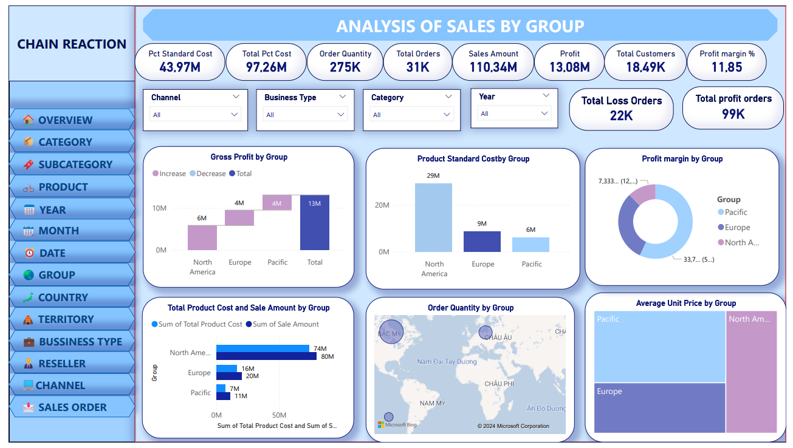
**Visual breakdown**

There are 3 groups: North America, Europe, Pacific.

- **Gross Profit by Group (Bar Chart):** Total 13M, with Pacific 4M decrease, Europe 6M, North America 1.3M.
- **Product Standard Cost by Group (Bar Chart):** North America 29M, Europe 9M, Pacific 6.5M.
- **Profit Margin by Group (Pie Chart):** North America 7,333 (12%), Europe 337 (5.1%), Pacific (negative or low).
- **Total Product Cost and Sale Amount by Group (Bar Chart):** North America 74M sales (80M cost—loss indicated), Europe 16M sales, Pacific 7M sales.
- **Order Quantity by Group (Map with Bubbles):** Concentrated in Asia-Pacific regions like Vietnam, China.
- **Average Unit Price by Group (Bar Chart):** Pacific highest, followed by North America, Europe.

**Key Findings:**
- Gross profit total 13M, Pacific shows 4M decrease but strong overall.
- Standard costs: North America 29M highest.
- Margins: North America 7,333 (12%), Europe low.
- Sales/costs: North America 74M sales (80M cost—potential loss).
- Quantity map: Focused in Asia-Pacific.
- Prices: Pacific highest.

**Conclusion:** Pacific group offers high potential despite decreases; mitigate North American losses through regional pricing.

## 11.Analysis of Sales by Country
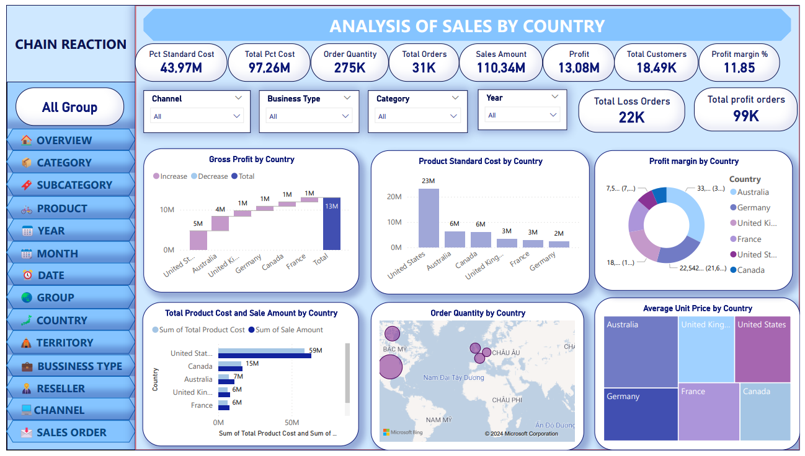
**Visual breakdown**

Countries including: United States, Canada, Australia, United Kingdom, France, Germany:

- **Gross Profit (Bar Chart):** US (5M), Australia (4M), UK (1M), Germany (1M), Canada (1M), France low.
- **Product Standard Cost (Bar Chart):** US 23M, Australia 6M, Canada 6M, UK 3M, France 3M, Germany 2M.
- **Profit Margin (Pie Chart):** Australia 7.5 (7%), Germany 18 (1%), US 22.542 (21.6%), Canada 33 (31.6%).
- **Total Product Cost and Sale Amount (Bar Chart):** US 59M sales (38M cost), Canada 15M, Australia 7M.
- **Order Quantity (Map): Bubbles** in Europe/Asia, labeled countries.
- **Average Unit Price (Bar Chart):** Color-coded by country.

**Key Findings:**
- US leads sales (59M), profit (5M), margins (22.542, 21.6%).
- Canada/Australia follow (15M/7M sales).
- Quantities concentrated in US/Canada.

**Conclusion:** US dominance suggests market focus; explore growth in Australia/Germany.

## 12.Analysis of Sales by Region
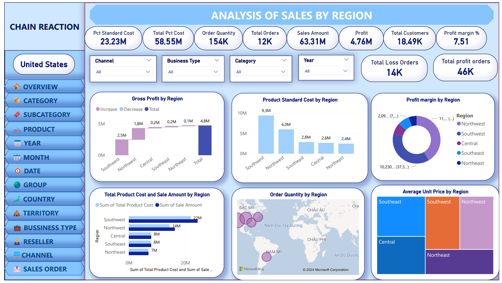
**Visual breakdown**

It filtered to United States regions:

- **Gross Profit (Bar Chart):** Total 4.8M, Southwest (2.5M), Northwest (1.8M), Central/Southeast low.
- **Product Standard Cost (Bar Chart):** Southwest 9.3M, Northwest 6.0M, Southeast 2.8M, Central 2.6M, Northeast low.
- **Profit Margin (Pie Chart):** Northwest 2.09 (0%), Southwest 10.230 (97.5%), others low.
- **Total Product Cost and Sale Amount (Bar Chart):** Northwest 22M sales (14M cost), Southwest 14M sales (8M cost).
- **Order Quantity (Map): Bubbles** in Asia, but labeled US regions—possible mismatch.
- **Average Unit Price (Bar Chart):** Varies by region color-coded.

**Key Findings:**
- Profit: Southwest (2.5M), Northwest (1.8M).
- Costs: Southwest 9.3M.
- Margins: Southwest 10.230 (97.5%).
- Sales: Northwest 22M.

**Conclusion:** Southwest and Northwest are key US regions; expand there while improving others.

## 13.Analysis of Sales by Channel
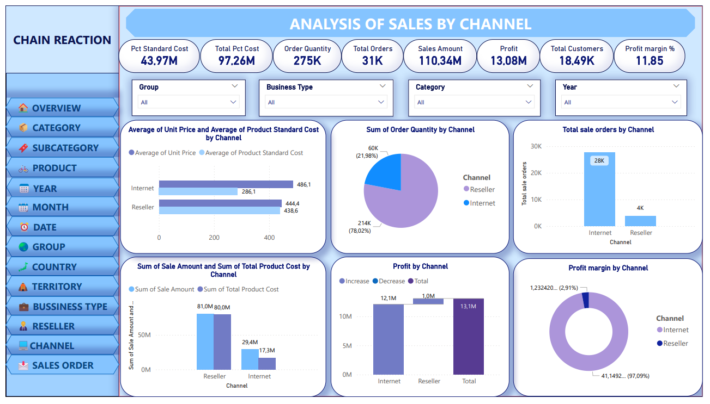
**Visual breakdown**

There are 2 channels: Internet, Reseller:
- **Average Unit Price and Average Product Standard Cost (Bar Chart):** Internet (461.1 price, 438.6 cost), Reseller (444.4 price, 413.1 cost).
- **Sum of Order Quantity (Pie Chart):** Reseller 214K (78.02%), Internet 60K (21.98%).
- **Total Sale Orders (Bar Chart):** Internet 28K, Reseller 4K.
- **Sum of Sale Amount and Sum of Total Product Cost (Bar Chart):** Internet 81.0M sales (29.4M cost), Reseller 29.4M sales (17.3M cost).
- **Profit (Bar Chart with** Increase/Decrease): Internet 12.1M increase, Reseller 1.0M, Total 13.1M.
- **Profit Margin (Pie Chart):** Reseller 1,232.0 (2.91%), Internet 41,492 (97.09%).

**Key Findings:**
- Internet has higher averages (461.1 price, 438.6 cost) and dominates quantity (60K, 21.98% vs. Reseller 214K, 78.02%—wait, pie shows Reseller higher).
- Orders: Internet 28K, Reseller 4K.
- Sales: Internet 81.0M (29.4M cost), Reseller 29.4M (17.3M cost).
- Profit: Internet 12.1M increase, total 13.1M.
- Margins: Internet 41,492 (97.09%), Reseller minimal (2.91%).

**Conclusion:** Internet channel is the profit engine; invest in digital expansion while evaluating Reseller efficiency.

## 14.Analysis of Sales by Sales order
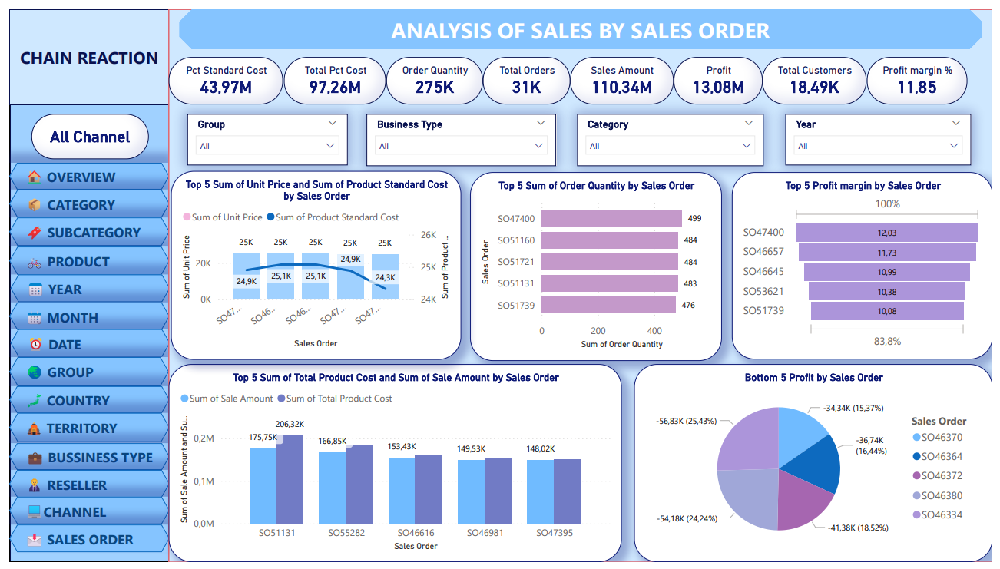
**Visual breakdown**

This dashboard focus on individual sales orders.

- **Top 5 Sum of Unit Price and Product Standard Cost (Line Chart):** Fluctuates around 24K-25K for orders like SO47400, SO51160.
- **Top 5 Sum of Order Quantity (Bar Chart):** SO47400 (499), SO51160 (484)
- **Top 5 Profit Margin (Bar Chart):** SO47400 (12.03%), SO46657 (11.73%).
- **Top 5 Sum of Total Product Cost and Sale Amount (Bar Chart):** SO51131 (206.32K sales), SO55282 (175.75K).
- **Bottom 5 Profit (Pie Chart):** Negative profits, SO46370 (-36.74K, 16.44%), total negative ~ -200K.

**Key Findings:**
- Top quantities: SO47400 (499), high margins (12.03%).
- Top sales: SO51131 (206.32K).
- Bottom profits: Negative, e.g., SO46370 (-36.74K, 16.44%).
- Overall, top orders drive positive margins, bottom show losses up to -58K.

**Conclusion:** High-performing orders boost metrics, but losses in low ones suggest order vetting or pricing adjustments.

# Proposed business strategy for enterprises
**1. Cost Control**
- Optimize production and supply processes: Review production processes to find out where costs can be cut without affecting product quality.
- Reduce production and transportation costs: Negotiate better prices with suppliers, optimize logistics and find new sources of supply.
- Review and cut unnecessary costs: Focus on activities that bring the highest value to the business.

**2. Enhance Marketing and Promotions**
- Invest in marketing and promotions in low-season quarters: Increase advertising spending and launch promotions to stimulate demand in Q1 and Q2.
- Flexible promotions: Apply discounts and special offers to customers who shop via the Internet and Resellers.
- Digital marketing strategy: Invest in SEO, online advertising and digital marketing campaigns to increase brand awareness and attract new customers.

**3. Enhance Customer Experience**
- Improve customer service: Ensure good customer support, resolve issues quickly and effectively.
- Loyalty programs: Create loyalty programs and incentives to encourage customers to return.
- Feedback and improvement: Collect feedback from customers to continuously improve products and services.

**4. Product Diversification**
- New product development: Conduct market research to identify new trends and develop appropriate products.
- Product portfolio optimization: Focus on high-margin products, eliminate or improve underperforming products.
- Product bundle development: Create attractive product bundles to increase order value and bring more benefits to customers.

**5. Sales Channel Optimization**
- Internet: Enhance digital marketing strategy, improve user experience on website and deploy flexible promotions.
- Reseller: Optimize supply chain, negotiate better prices with suppliers and support sales agents more effectively.
- Both channels: Conduct detailed analysis to understand why the Internet channel is performing better and apply those experiences to the Reseller channel.

**6. Increase Average Order Value**
- Cross-sell and upsell strategies: Encourage customers to buy additional related products or upgrade existing products.
- Develop high-value product bundles: Create attractive product bundles to increase average order value.
- Offer incentives: Apply incentives to customers when they increase their order value.

**7. Improve Operational Efficiency**
- In North America: Review and cut unnecessary costs, renegotiate with suppliers to reduce input costs, improve manufacturing and logistics processes.
- In Europe: Learn and apply good practices from the Pacific region, optimize the supply chain to reduce costs and invest in technology to increase productivity.
- Expand the Pacific market: Increase marketing and sales investment, develop products suitable for local tastes and seek strategic partners to expand the distribution network.

# Conclusion

**Results achieved**
- Evaluate the current sales performance of Chain Reaction Cycles Company.
- Identify the strengths, weaknesses, opportunities and challenges in the company's sales activities based on data
- Propose solutions to improve sales performance.
- Support Chain Reaction Cycles Company in making strategic business decisions

**Advantages and disadvantages**

**Advantages:**
- Available data: Chain Reaction Cycles Company has provided the team with detailed sales data including revenue, conversion rate, average 
order value, etc. This data helps the team easily analyze and evaluate the company's sales performance.
- Supporting tools: There are many free and paid data analysis tools available on the market, helping the team easily process and analyze data effectively.

**Difficulties:**
- Lack of data: Some important data such as customer behavior data, competitor data, etc. are not fully collected. This makes it difficult to analyze the company's sales performance.