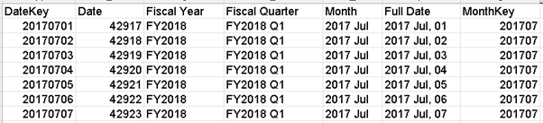
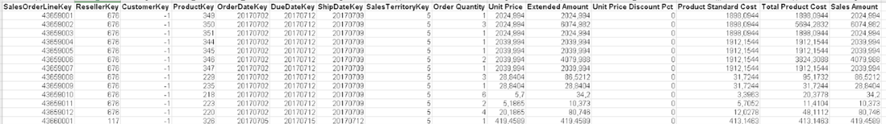
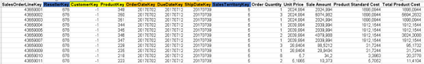
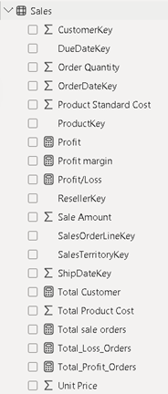
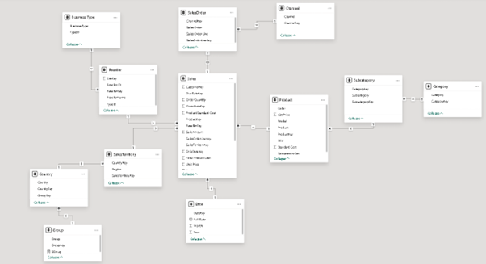
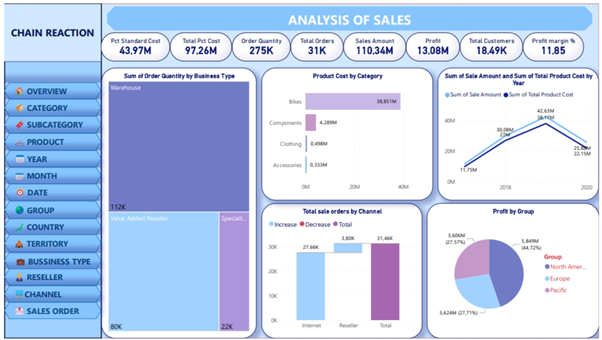
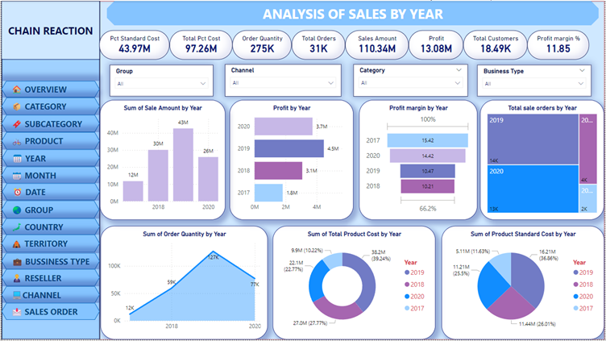
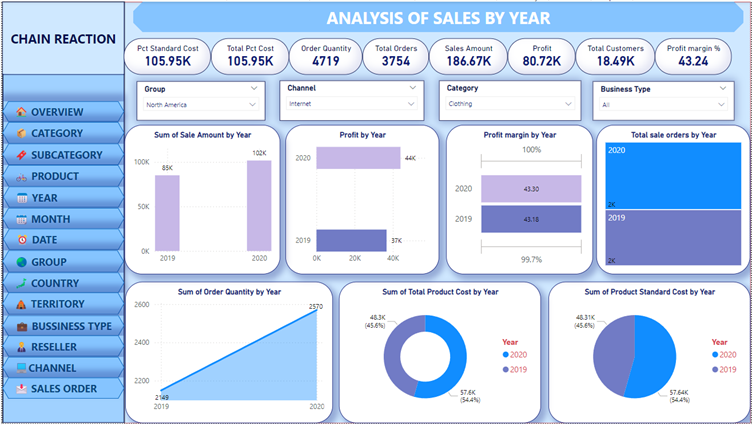
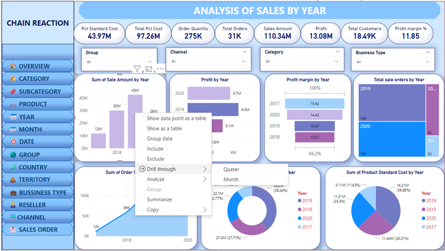

# Chain Reaction Cycles – Sales Performance Analysis
**Author:** Chau My Phuong

**Date:** June 2024

**Project Description**

In today’s business landscape, data has become one of the most valuable assets any organization can possess. This project leverages the real-world-like AdventureWorks Sales dataset to deeply analyze the sales performance of Chain Reaction Cycles – once the world’s largest online bicycle retailer. The result is a production-grade analytics dashboard that reveals exactly where profit is made and lost across channels, regions, product lines, seasons, and resellers – turning raw numbers into clear business decisions.

The project covers the lifecycle including: data collection, cleansing, advanced DAX measurements, modeling, visualizations, exploratory analysis, and actionable strategic recommendations.

**Project Objectives**
- Evaluate the current sales performance of Chain Reaction Cycles Company
- Propose solutions to improve sales performance
- Propose marketing strategies to attract more potential customers
- Propose measures to increase conversion rates
- Propose pricing strategies to maximize profits
- Propose measures to improve customer experience
-----

# Background
## Overall
- **Company Name:** Chain Reaction Cycles (CRC)
- **Year Established:** 1985
- **Business Industry:** Bicycles, including bicycles, parts and accessories.
- **Business Size:** Small Retail
- **Market segment:** cycling enthusiasts, from beginners to professional riders.
- **Products:** mountain bikes, road bikes, city bikes, and accessories and spare parts.
- **Awards and achievements:** CRC's customer support team won the "Customer Service Team of the Year" award for the whole of Europe for their efficient workflow and ability to use customer feedback to improve service
- **Vision:** Chain Reaction Cycles aims to be the world's leading bicycle retailer, providing the best online cycling shopping experience for customers worldwide.
- **Mission:** Chain Reaction Cycles is committed to providing high-quality products and services, dedicated customer support, and always updating technology to improve the user experience.

## History:
 - Chain Reaction Cycles began as a small shop called Ballynure Cycles in Northern Ireland in 1985, founded by George and Janice Watson.
 - In 1998, the business moved to mail order
 - In 1999 launched ChainReactionCycles.com, serving customers in over 155 countries, ushering in a period of strong growth in e-commerce.
 - CRC rapidly expanded to become one of the world's leading online bicycle retailers, with sales peaking in 2013.
 - In 2016, Chain Reaction Cycles merged with Wiggle to form the WiggleCRC group.
 - The group then achieved an annual turnover of over £300 million and expanded further with the acquisition of German company Bike24 in 2017.

## Organizational chart
Chain Reaction Cycles operates under the management of an executive board consisting of senior managers from various departments. Departments include:
- **Sales and marketing department:** Responsible for promoting and selling products.
- **Customer service department:** Multilingual customer support team, answering questions and handling warranty-related issues.
- **Warehouse and shipping department:** Manages the storage and shipping of goods to customers worldwide.
- **Engineering department:** Ensures bicycle products and components are assembled and quality tested before shipping.

## Daily Operations
CRC's daily operations include warehouse management, online order processing, customer service, website management, and online marketing campaigns. CRC also invests in improving customer service and optimizing delivery times worldwide.
- **Order Processing:** Each week, Chain Reaction Cycles processes approximately 100,000 products and ships them to customers worldwide. CRC's state-of-the-art warehouse management system and staff ensure that orders are processed quickly and accurately, efficiently meeting the shopping needs of global customers.
- **Multilingual Customer Support:** CRC's customer support team of 82 people is fluent in 7 languages: English, French, Italian, Spanish, German, Russian, and Portuguese. The customer service team is available from 7am to 6pm, 7 days a week to support customers via phone, email, social media and online chat.
- **Inventory management and shipping process:** CRC's large inventory management system is optimized to track and maintain accurate inventory levels to ensure that products are always available to customers. CRC's shipping process is also designed to optimize delivery times and shipping costs for customers.

## Purpose and significance of data collection and data analysis
Data collection and analysis helps CRC better understand customer shopping behavior, market trends and consumer needs. This allows CRC to optimize marketing strategies, improve customer experience and manage inventory more effectively. Specifically:
- **Customer shopping behavior:** Helps identify customer trends and preferences, develop more accurate and effective marketing strategies.
- **Market trends:** Helps predict customer demand and adjust inventory levels appropriately, avoiding shortages or surpluses.
- **Customer experience:** Helps identify areas for improvement in the shopping process and customer service, improve service quality and increase customer satisfaction customer flow.
In addition, data analysis also helps CRC optimize internal processes such as inventory management, order processing and shipping. Monitoring and analyzing data helps detect problems and bottlenecks in the process, propose timely improvement measures, improve operational efficiency, minimize costs and enhance competitiveness in the market.

# Data introduction
The data used for this project is extracted from a single data file, providing a comprehensive view of sales activities.
- **Data file name:** 4-AdventureWorks Sales.xlsx
- **Source:** Data provided by lecturer Pham Thi Thanh Tam.

This data file includes 7 separate sheets/tables, linked together to describe the business process and related entities in detail. The combination of these tables allows the team to perform multidimensional analysis of business activities, thereby making effective assessments and strategic recommendations.

**16 data tables include:**
1. **SalesOrderLine:** Contains line items for sales orders, identifying each product in an order.
2. **SalesOrder:** Contains detailed information about orders that have been placed.
3. **Sales:** The main transaction data table, records sales events.
4. **Channel:** Dimension table for sales channels.
5. **Sales Territory:** Contains information about the geographical areas where sales activities take place.
6. **Country:** Countries involved in sales (United States, Canada, France, Germany, Australia, United Kingdom), grouped by regions.
7. **Group:** High-level geographic groups (North America, Europe, Pacific)
8. **City:** Cities with associated state/provinces.
9. **State-Province:** States or provinces linked to countries.
10. **Reseller:** Contains information about retail partners.
11. **Business Type:** Types of reseller businesses (Value Added Reseller, Specialty Bike Shop, Warehouse)
12. **Date:** Contains time-related data (often used for cyclical analysis).
13. **Product:** Contains descriptive information about the items sold.
14. **Subcategory:** Product subcategories
15. **Category:** High-level product categories
16. **Customer:** Contains detailed information about customers who purchased the product.

**Specific table data description:**

**1. SalesOrderLine** 
| No. | Attribute Name | Description | Data Type | Note |
|:---:|:---|:---|:---:|:---|
| 1 | SalesOrderLineKey | Unique identifier for each order line | Number | Primary Key |
| 2 | Sales Order Line | Human-readable sales order + line number | Short Text | Display purpose |

**2. SalesOrder** 
| No. | Attribute Name | Description | Data Type | Note |
|:---:|:---|:---|:---:|:---|
| 1 | Sales Order | Sales order number | Short Text |
| 2 | SalesOrderLineKey | Link to individual line item | Number | Foreign Key |
| 3 | Sales Order Line | Line identifier within the order | Short Text |
| 4 | ChannelKey | Sales channel (1 = Reseller, 2 = Internet) | Number | Foreign Key |

**3. Sales** (Fact Table) 
| No. | Attribute Name | Description | Data Type | Note |
|:---:|:---|:---|:---:|:---|
| 1 | SalesOrderLineKey | Link to order line | Number | Primary / Foreign Key |
| 2 | ResellerKey | Reseller ID | Number | Foreign Key |
| 3 | CustomerKey | Customer ID | Number | Foreign Key |
| 4 | ProductKey | Product sold | Number | Foreign Key |
| 5 | OrderDateKey | Date of order | Number | Foreign Key to Date |
| 6 | DueDateKey | Promised delivery date | Number | Foreign Key to Date |
| 7 | ShipDateKey | Actual shipping date | Number | Foreign Key to Date |
| 8 | SalesTerritoryKey | Sales territory/region | Number | Foreign Key |
| 9 | Order Quantity | Quantity ordered | Number |
| 10 | Unit Price | Selling price per unit (after discount) | Currency |
| 11 | Sale Amount | Line total (Quantity × Unit Price) | Currency |
| 12 | Product Standard Cost | Standard manufacturing cost per unit | Currency |
| 13 | Total Product Cost | Total cost (Quantity × Standard Cost) | Currency |

**4. Channel** 
| No. | Attribute Name | Description | Data Type | Note |
|:---:|:---|:---|:---:|:---|
| 1 | ChannelKey | Unique key | Number | Primary Key |
| 2 | Channel | Channel name (Reseller / Internet) | Short Text |

**5. SalesTerritory** 
| No. | Attribute Name | Description | Data Type | Note |
|:---:|:---|:---|:---:|:---|
| 1 | SalesTerritoryKey | Unique territory key | Number | Primary Key |
| 2 | Region | Region name (e.g., Northwest) | Short Text |
| 3 | CountryKey | Link to Country table | Number | Foreign Key |

**6. Country** 
| No. | Attribute Name | Description | Data Type | Note |
|:---:|:---|:---|:---:|:---|
| 1 | CountryKey | Unique key | Number | Primary Key |
| 2 | Country | Country name | Short Text |
| 3 | GroupKey | Link to geographic group | Number | Foreign Key |

**7. Group** 
| No. | Attribute Name | Description | Data Type | Note |
|:---:|:---|:---|:---:|:---|
| 1 | GroupKey | Unique key | Number | Primary Key |
| 2 | Group | Region group | Short Text |

**8. City** 
| No. | Attribute Name | Description | Data Type | Note |
|:---:|:---|:---|:---:|:---|
| 1 | CityKey | Unique key | Number | Primary Key |
| 2 | City | City name | Short Text |
| 3 | StateProvinceKey | Link to State-Province table | Number | Foreign Key |

**9. State-Province** 
| No. | Attribute Name | Description | Data Type | Note |
|:---:|:---|:---|:---:|:---|
| 1 | StateProvinceKey| Unique key | Number | Primary Key |
| 2 | State-Province | State or province name | Short Text |
| 3 | CountryID | Link to Country | Number | Foreign Key |

**10. Reseller** 
| No. | Attribute Name | Description | Data Type | Note |
|:---:|:---|:---|:---:|:---|
| 1 | ResellerKey | Unique key | Number | Primary Key |
| 2 | Reseller ID | Business code | Short Text |
| 3 | TypeID | Link to Business Type | Number | Foreign Key |
| 4 | ResellerName | Reseller company name | Short Text |
| 5 | CityKey | Location of reseller | Number | Foreign Key |

**11. Business Type** 
| No. | Attribute Name | Description | Data Type | Note |
|:---:|:---|:---|:---:|:---|
| 1 | TypeID | Unique key | Number | Primary Key |
| 2 | Business Type | Type of business | Short Text |

**12. Date** 
| No. | Attribute Name | Description | Data Type | Note |
|:---:|:---|:---|:---:|:---|
| 1 | DateKey | YYYYMMDD format | Number | Primary Key |
| 2 | Full Date | Readable date | Short Text |
| 3 | Year | Calendar year | Number |
| 4 | Month | Month number | Number |

**13. Product** 
| No. | Attribute Name | Description | Data Type | Note |
|:---:|:---|:---|:---:|:---|
| 1 | ProductKey | Unique product identifier | Number | Primary Key |
| 2 | SKU | Stock-keeping unit | Short Text |
| 3 | Product | Product name | Short Text |
| 4 | Standard Cost | Manufacturing standard cost | Currency |
| 5 | Color | Product color | Short Text |
| 6 | List Price | Original list price | Currency |
| 7 | Model | Model name | Short Text |
| 8 | SubcategoryKey | Link to Subcategory | Number | Foreign Key |

**14. Subcategory** 
| No. | Attribute Name | Description | Data Type | Note |
|:---:|:---|:---|:---:|:---|
| 1 | SubcategoryKey | Unique key | Number | Primary Key |
| 2 | Subcategory | Subcategory name | Short Text |
| 3 | Categorykey | Link to Category | Number | Foreign Key |

**15. Category** 
| No. | Attribute Name | Description Description | Data Type | Note |
|:---:|:---|:---|:---:|:---|
| 1 | CategoryKey | Unique key | Number | Primary Key |
| 2 | Category | Main category | Short Text |

**16. Customer** 
| No. | Attribute Name | Description | Data Type | Note |
|:---:|:---|:---|:---:|:---|
| 1 | CustomerKey | Unique key | Number | Primary Key |
| 2 | Customer ID | Business identification code | Short Text |
| 3 | Customer | Full name of the customer | Short Text |
| 4 | City | Customer city | Short Text |
| 5 | State-Province | State or province | Short Text |
| 6 | Country-Region | Country name | Short Text |
| 7 | Postal Code | Postal/ZIP code | Short Text |

# Data preparation & Pre-processing 
All preprocessing steps were performed in Power Query and Power Pivot (Excel/Power BI), resulting in a clean, well-structured, and analysis-ready data model.
## Data collection
After reviewing several datasets on Kaggle, I selected the AdventureWorks Sales dataset as the most suitable proxy for analyzing Chain Reaction Cycles (CRC) sales performance.

**Steps performed:**
- **Step 1:** Searched for relevant sales datasets on Kaggle
- **Step 2:** Downloaded the complete dataset
- **Step 3:** Extracted and chose the main file for analysis
  
→ **File used:** 4-AdventureWorks Sales.xlsx

## Data cleaning
The following cleaning actions were applied:
- **In the Date table:** 

Fiscal Year and Month columns were not in the desired format → reformatted using Excel formulas for consistency.
- **In the Sales fact table:**

  - Unit Price Discount Pct column contained only zeros across all rows → removed as redundant.
  - Because the Unit Price Discount Pct column is deleted data, it affects the Sales Amount column, so the Sales Amount column is also deleted.
  - Extended Amount was renamed to Sales Amount to correctly reflect line total revenue.

## Data transformation
To enable deeper and more flexible analysis, I transformed the flat structure into a proper Snowflake schema by normalizing dimension tables:
- Extracted Group and Country from SalesTerritory → created hierarchy: Group → Country → Territory
- Extracted Business Type from Reseller → created hierarchy: Business Type → Reseller
- Extracted Category and Subcategory from Product → created hierarchy: Category → Subcategory → Product
- Extracted Channel from Sales Order data → created hierarchy: Channel → SalesOrder

**Custom DAX Measures created:**
- **Profit:** Total Sales Amount - Total Cost
- **Profit Margin (%):** Profit divided by Total Sales Amount (formatted as a percentage)
- **Total Customers:** Count of the distinct values in the 'CustomerKey' column
- **Total Sale Orders:** Count of the distinct values in the 'Sales Order' column
- **Profit/Loss Flag:** "Profit" if Total Sale Amount - Total Product Cost is greater than zero, "Loss" if less than zero, and "Break Even" if equal to zero.
- **Total Loss Orders:** Count of distinct Sales Orders where the total Profit for that entire order is less than zero.
- **Total Profit Orders:** Count of distinct Sales Orders where the total Profit for that entire order is greater than zero.

## Data Reduction
In the Date table, the Monthkey and Date columns are the columns whose data will be deleted because this is redundant data for the group. In addition, the Customer table data is also chosen by the group to be ignored, not analyzed and used much other than to calculate the total number of customers who have purchased because the table data is difficult to analyze and does not have a clear connection with other tables as well as the Sales table.

## Data Model

- Model type: This is a Snowflake Schema data model
- Structure:
  - There is a central table called "Sales" (fact table).
  - Relationship between tables:
    - Sales → Date
    - Sales → SalesOrder → Channel 
    - Sales → Product → Subcategory → Category
    - Sales → SalesTerritory → Country → Group
    - Sales → Reseller → Business Type

# Analysis
## Overview dashboard

The Overview dashboard provides an overview of CRC's sales performance.

Financial metrics that businesses are interested in can help businesses monitor and evaluate sales performance.
- Standard cost: 43.97 million
- Total cost: 97.26 million
- Number of products sold: 275 thousand
- Total orders: 31 thousand
- Total revenue: 110.34 million
- Profit: 13.08 million
- Total customers: 18.49 thousand
- Profit margin: 11.85%

**The chart shows the company's total sales and Total product costs by year from 2018 to 2020**

The company's total sales have increased steadily from 2018 to 2019 and started to change after 2019.
- The growth rate increased steadily and reached its highest in 2019, with 42.63 million.
- By 2020, it began to decline sharply, down to 25.88 million.

The company's total expenses have increased steadily but at a slower rate than revenue from 2018 to 2020.
- The highest growth rate was achieved in 2019, reaching 38.17 million.
- However, by 2020, the company's profit began to decline to 22.15 million.

-> The chart shows that the business is growing well from 2018 to 2020. Sales revenue increased quite steadily, product costs were well controlled, so the growth rate was quite slow.

**The chart shows the total number of products by business type**
- The business type with the highest number of products is "Warehouse" with 112,000 products, accounting for 40.7% of the total number of products.
- The business type with the lowest number of products is "Specialty Bike Shop" with 22,000 products, accounting for only 8% of the total number of products.
- The business type "Vaule Added Reseller" achieved 80,000 products, accounting for 29.09%

-> From there, we can see that the Warehouse type is accounting for the highest number of products sold compared to the other two types of businesses.

**The chart shows the estimated total production cost for each product category**
- The product type with the highest standard cost is "Bikes" with 84.105 million, accounting for 86.47% of the total cost.
- The product type with the lowest standard cost is "Accessories" with 0.638M, accounting for only 0.5% of the total cost.

-> This shows that the standard cost of the Bike product type is the highest, followed by Components with 10.766 million, Clothing with 1.749 million and finally Accessories with 0.638 million.

**The chart shows the total number of sales orders by sales channel**

Based on the chart, we see that there are 2 sales channels:
- On the Internet sales channel, the number of orders is 27.66K, accounting for 87.92%
- On the Reseller sales channel, the number of orders is 3.80K, accounting for 12.08%

-> This shows that customers buy mainly on the Internet sales channel, with the number of orders accounting for 75.84% more than on the Reseller channel.

**The chart shows the standard cost of products by region**
- The region with the highest product profit is North America with 5.849 million, accounting for 44.72%.
- The region with the lowest product profit is Pacific with 3,606 million, accounting for 27.57%.
- The remaining region is Europe with a profit of 3,624 million, accounting for 27.71%

-> This shows that the North America region is the most profitable market for the business, accounting for more than 2/3 of the total standard product cost. Next are Europe and Pacific with profits that do not differ too much.

## Year dashboard

This dashboard provides an overview of the company's annual business figures.

In the dashboard, there are charts showing each index of each year that the company is interested in so that it can monitor and analyze business performance, thereby making strategic decisions to improve business performance and maintain sustainable development.

**Chart 1: Sum of Sale Amount by Year**
- Vertical column chart showing total revenue by year from 2017 to 2020. Evaluate revenue growth over the years to determine growth trends and adjust business strategies in a timely manner.
- 2017: 12M
- 2018: 30M
- 2019: 43M
- 2020: 26M

-> This show that the company’s revenue performance has seen strong growth over the 2017–2019 period, from a low of $12 million in 2017 (possibly due to lack of brand recognition) to a peak of $43 million in 2019. This growth is attributed to effective marketing campaigns or new product launches. However, this growth is not sustainable, as revenue declined slightly by 17% in 2020. More importantly, while the revenue growth from 2017 to 2019 has driven absolute profit growth, the profit margin (%) has shown a declining trend. This suggests that costs (or cost of goods sold) may have increased at a faster rate than revenue growth, reducing the company’s overall operating efficiency.

**Chart 2: Profit by Year**
- Horizontal bar chart showing total profit by year from 2017 to 2020. Tracking annual profit to ensure the company is achieving its profit target and taking steps to improve where necessary.
- 2017: 1.8M
- 2018: 3.1M
- 2019: 4.5M
- 2020: 3.7M

-> The company experienced strong revenue and profit growth from 2017 ($12M Revenue, $1.8M Profit) to 2019 ($43M Revenue, $4.5M Profit). However, despite this peak, profit margins showed a downward trend (suggesting high cost growth). This financial stress culminated in 2020, where both Revenue (down 17%) and Profit (down to $0.8M) dropped sharply.

**Chart 3: Profit by Year**
- The funnel chart shows profit margins by year to measure business performance through profit margins, helping the company optimize costs and increase value from revenue.
- 2017: 15.42%
- 2018: 10.21%
- 2019: 10.47%
- 2020: 14.42%
-> The company's efficiency, measured by profit margin, saw its highest point in 2017 (15.42%) due to strong cost control early on. However, margin efficiency dropped significantly by 5.21% in 2018 (to 10.21%), likely due to high fixed costs or insufficient revenue growth to offset those costs. While the company steadily increased margins from 2018 to 2020 through strategic adjustments, the margins in 2020 were still 1% lower than the 2017 peak, indicating that the company has not yet fully regained its initial level of cost-management efficiency.

**Chart 4: Total sales orders by Year**
- The treemap chart shows the total number of orders by year to evaluate the transaction volume, determine the level of market activity and adjust the marketing and sales strategy.
- 2017: 2K
- 2018: 4K
- 2019: 14K
- 2020: 13K
-> The company's order volume demonstrated a strong expansion phase, steadily increasing until a peak of 14K orders in 2019, reflecting high market demand and effective fulfillment capabilities. This growth was particularly sharp from the low points of 2K orders in 2017 and 4K orders in 2018. However, the volume saw a minor moderation in the final year, decreasing slightly to 13K orders in 2020.

**Chart 5: Sum of Order Quantity by Year**
- The line chart shows the total number of orders by year to track the fluctuations in the number of orders to manage inventory, production and meet customer needs more effectively.
- 2017: 12K
- 2018: 59K
- 2019: 127K
- 2020: 77K
The company achieved massive growth in total orders (from 12K to 127K) and revenue (from $12M to $43M) between 2017 and 2019, peaking in the latter year. However, this growth was costly: profit margins consistently declined due to rising costs per product, indicating efficiency issues. The overall upward trend abruptly reversed in 2020, when orders, revenue, and profit all dropped sharply, signaling a major market contraction and the negative culmination of the underlying cost problems.

**Chart 6: Sum of Total Product Cost by Year**
- The pie chart shows the total product cost by year to manage and control production costs, thereby optimizing profits and improving operational efficiency.
- 2017: 9.9M (10.22%)
- 2018: 27.0M (27.77%)
- 2019: 38.2M (39.24%)
- 2020: 22.1M (22.77%)
-> The company's product cost structure was highly volatile, starting lowest in 2017 (10.22%) due to smaller scale. The cost proportion increased sharply to a peak of 39.24% in 2019, suggesting significant investment in production scale or product quality to meet high demand. This aggressive cost ratio then decreased substantially to 22.77% in 2020, reflecting the sharp decline in overall sales volume during that year.

**Chart 7: Sum of Product Standard Cost by Year**
- The last pie chart in the dashboard shows the estimated cost of producing a product by year to evaluate cost efficiency and adjust production strategies to improve profit margins.
- 2017: 5.11M (11.63%)
- 2018: 11.44M (26.01%)
- 2019: 16.21M (36.86%)
- 2020: 11.21M (25.5%)
-> The company's estimated cost of manufacturing a product, expressed as a proportion of total cost, was highly variable. This proportion increased steadily from 2017 to a peak of 36.86% in 2019, suggesting significant investment in production quality or rising raw material costs to meet soaring demand. This trend was a major factor in the declining profit margins observed during this growth period. Following 2019, the proportion fell sharply to around 11.2% in 2020, reflecting the market contraction and subsequent reduction in production scale.

### Filter
- To help users see other branches by year more clearly, such as viewing data by continent, sales channel or product classification, the dashboard should have filters for Group, Channel, Category and Business Type.

- After viewing the overview dashboard analyzing the sales year, we can use filters to compare data between groups (Group), sales channel (Channel), product category (Category), and business type (Business Type). Through this comparison, we will see the difference in sales data by year, helping to identify trends, strengths and weaknesses to make more appropriate strategic adjustments.

For example, when looking at metrics such as revenue, profit, profit margin, total orders, total order quantity, product cost, and estimated product manufacturing cost by North America region, through the Internet sales channel, and the product category "Clothing" in 2019 and 2020, we can see clear changes and trends.

### Drill through

By using the Drill Through function, it is easy to move from an overview report to a detailed report, helping businesses analyze more deeply and make accurate business decisions:
- **Revenue and Profit Trend Analysis:** Drill Through allows analysts to immediately break down the peak 2019 revenue and highest profit figures into quarterly or monthly performance. This isolates the exact periods where the company performed best, helping to identify successful campaigns, seasonal patterns, or specific market events that drove the success.
- **Efficiency and Margin Control:** By drilling into profit margins by month in 2019, the business can pinpoint periods of maximum efficiency and contrast them with periods needing improvement. This is key for optimizing cost management and adjusting pricing strategies.
- **Order Volume and Demand:** Applying Drill Through to the total number of orders and detailed order numbers reveals specific order trends and peak seasonality within 2019. This information is essential for logistics, sales forecasting, and production planning to ensure supply meets demand.
- **Cost Management and Production:** Finally, drilling into product costs and the estimated cost of manufacturing a product by quarter or month allows for precise cost control and validation of production efficiency. This helps manage product quality investments against overall profitability.
